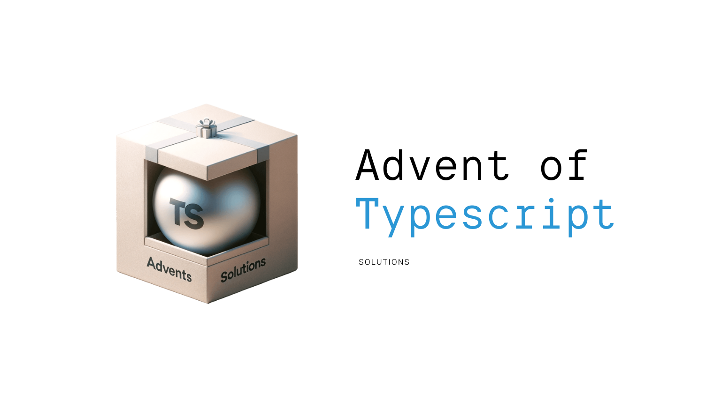

# Advent of Type Script



This is a repository for my solutions to the [Advent of Typescript 2023](https://typehero.dev/aot-2023) challenges.

## Solutions

| Day | Challenge |
| --- | --------- |
| 1 | [Christmas Cookies](./day1/readme.md) |
| 2 | [Christmas Cookies Inventory](./day2/readme.md) |
| 3 | [The Gift Wrapper](./day3/readme.md) |

## Usage

To run the solutions, you need to have [Node.js](https://nodejs.org/en/) installed.

Follow these steps to run the solutions:

Clone the repository:

```bash
git clone https://github.com/sierikov/advent-of-typescript.git
```

Then navigate to the repository directory:

```bash
cd advent-of-typescript
```

Install the dependencies:

```bash
npm install
```

Run following to check the solution for a specific day
(replace `2023` and `day1` with the appropriate day):

```bash
npx ts-node 2023/day1/solution.ts     
```

Run following to check the solution for all days:

```bash
npm test
```
